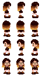

# Melty Sluicci

This project is open to anyone in the Melty Sluice Discord server!

## Contributing

### Code

Ask me to add you as a contributer to the repository and submit a PR!

If you're not comfortable with Git, work in a separate scene, then upload that scene and any associated resources in a ZIP archive to the Discord thread. A programmer will bring it into the project when they get around to it.

### Graphics

Upload a PNG of your graphic to the Discord thread! A programmer will bring it into the project when they get around to it.

### Audio

Upload a WAV of your song to the Discord thread (256kbps OGG also fine for music but not for sound effects). A programmer will bring it into the project when they get around to it.

## Resource Guidelines

| Resource Type          | Guidelines  |
|------------------------|-------------|
| Sprites/Textures       | PNG         |
| Character Spritesheets | See below.  |
| Music                  | 256kbps OGG |
| Sound Effects          | WAV         |

### Character Spritesheets

These should be in PNG format. They should also be a 3 by 4 sheet with every frame the same size, and the order of the frames must match the sheet below.

Each row is the character walking in a different direction, and the middle frame of each row is the character standing when facing that direction.
